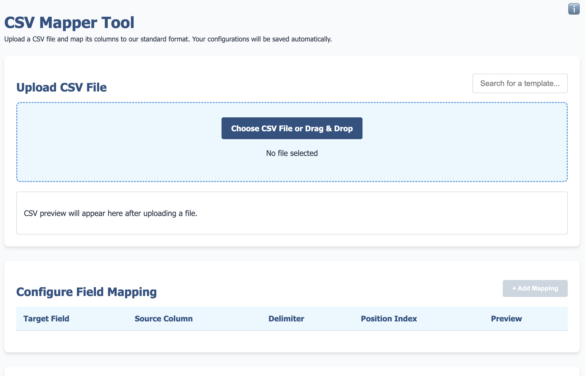

# README.md

# CSV Mapper Tool

A lightweight, browser-based tool for mapping CSV data without server dependencies visit [dataFormatters.com](https://dataformatters.com).

## CSV Utilities Collection

A collection of tools for CSV data processing and transformation.
For more advanced features, visit [dataFormatters.com](https://dataformatters.com).

## Features

- **Single-File Application**: Everything contained in one HTML file for easy deployment and sharing
- **Template-Based Mapping**: Map your CSV data to predefined templates
- **Field Transformation**: Split fields using delimiters and extract specific positions
- **Interactive Preview**: See how your data will be mapped in real-time
- **No Server Required**: Works entirely in the browser with no backend dependencies
- **Drag & Drop Interface**: Easy file uploading with drag and drop support
- **Searchable Templates**: Quickly find the template you need with search functionality

## Usage

1. **Open the Application**: Simply open the `csv-mapper.html` file in any modern web browser
2. **Upload Your CSV**: Either click the upload button or drag and drop your CSV file
3. **Select a Template**: Choose the appropriate template for your data after save first time
4. **Configure Mappings**:
   - Select the source column for each target field
   - Optionally specify delimiters to split fields
   - Set position indices to extract specific parts of split fields
   - Dynamically add new field mappings as needed
5. **Generate Mapped CSV**: Click the button to create and download your mapped CSV file, and add/update new template to browser local storage

## Templates

The application do not includes the pre-defined templates but over time new template added to browser local storage:

## Implementation Details

The CSV Mapper is built using:

- **HTML5**: For structure and file upload capabilities
- **CSS3**: For styling and responsive design
- **Vanilla JavaScript**: For all functionality with no external dependencies

## Browser Compatibility

The application is compatible with:
- Chrome 60+
- Firefox 60+
- Safari 12+
- Edge 79+

## Installation

No installation required! Simply download the `csv-mapper.html` file and open it in a web browser.

## Contributing

Contributions are welcome! Please feel free to submit a Pull Request.

## License

This project is licensed under the MIT License - see the LICENSE file for details.
